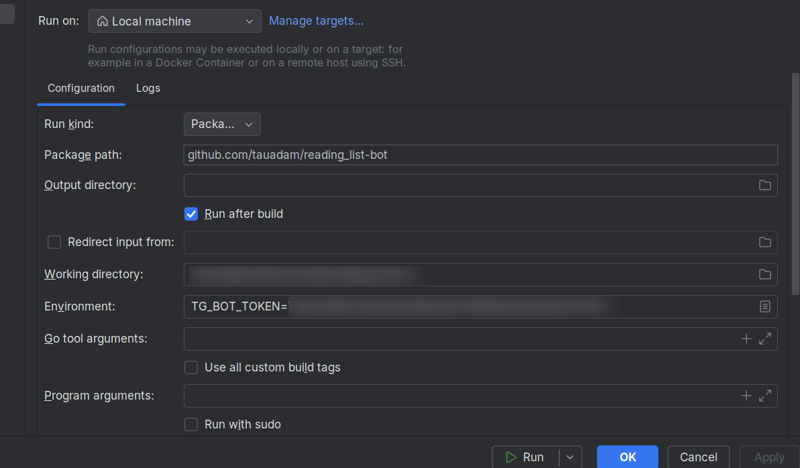
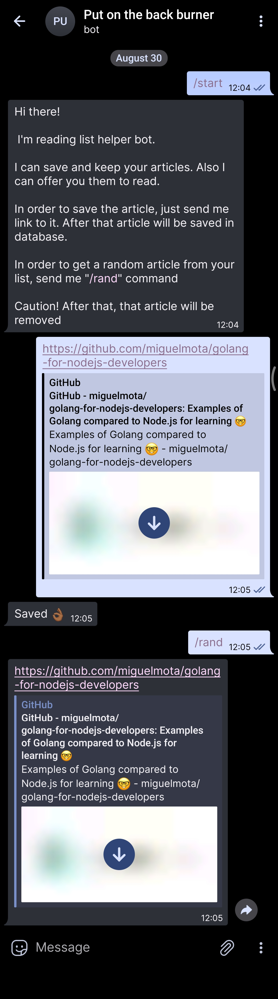
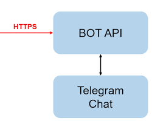

This is a simple bot that saves links to articles and books that you want save for reading later.
It can pick random link from the list, so you won't have to suffer with the choice.

## Self-hosting instructions
- Download repository
  ```shell
  git clone https://github.com/TauAdam/reading_list-bot.git
  ```
- Install
    ```go
    go build -o=bin main.go
    ```
- Execute with environment variable
    ```bash
    TELEGRAM_BOT_TOKEN=your_token ./bin
    ```
- If you have goland, then you can configure, run it like this:
  

> Note: you should get token from Botfather bot in telegram

## Showcase



## Features

- Save links to articles and books
- Pick random link from the list
- Start reading from the list
- Help command

### Roadmap

- [x] Handle main commands: save, start, help, pick random
- [x] Save links to articles and books
- [x] Pick random link from the database
- [x] Finish sqlite storage

## What package includes

- Built in client for Telegram API
- Local disk storage
- Sqlite storage

## Engineering practises

- clean code
- abstract interfaces
- not depends on realization of messenger (Telegram in that case)
- using context for canceling long operations

## Components of application

- main.go: The entry point of the application.
- Event Processor: Handles incoming Telegram updates.
- Fetcher: Fetches data from various sources (e.g., RSS feeds, websites).
- Processor: Processes fetched data and stores it in the database.
- Storage: Stores processed data (e.g., articles, books).
- Client: The Telegram bot client that interacts with users.
- Consumer: Consumes processed data and sends it to users (e.g., via Telegram).
- The Botfather: The Telegram Bot API service.

## Data Flow:

- Telegram updates: Incoming Telegram updates are received by the Event Processor.
- Data fetching: The Fetcher fetches data from various sources based on the received updates.
- Data processing: The Processor processes the fetched data and stores it in the Storage.
- Data consumption: The Consumer retrieves processed data from the Storage and sends it to users via the Client.
- Botfather interaction: The Client interacts with the Botfather to send messages to users.


